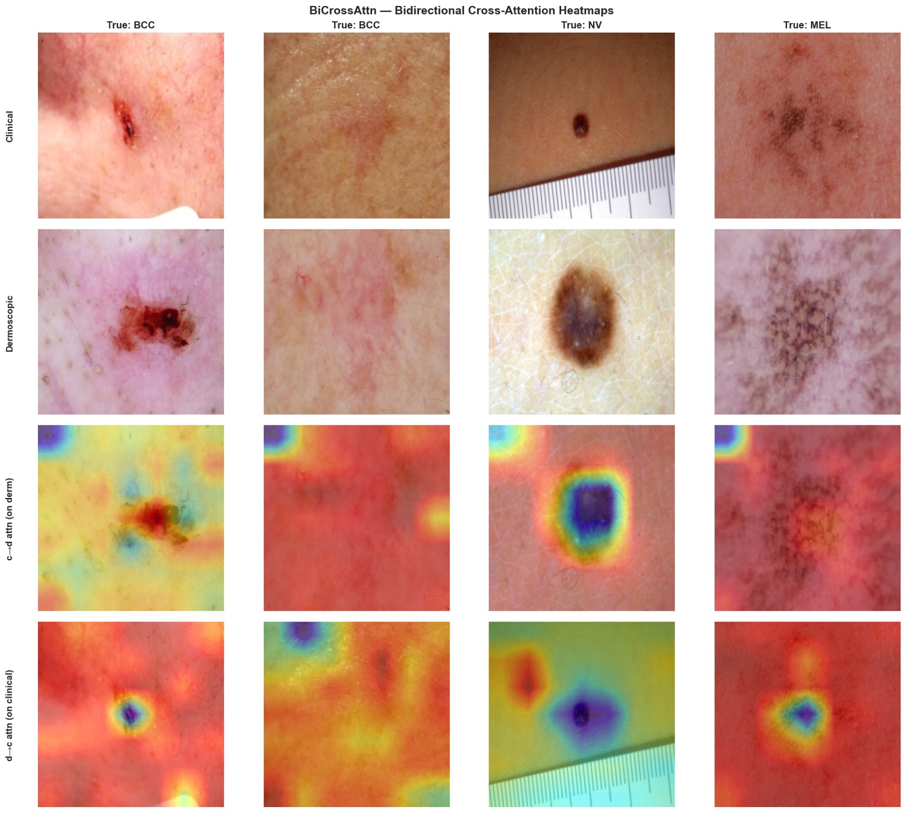
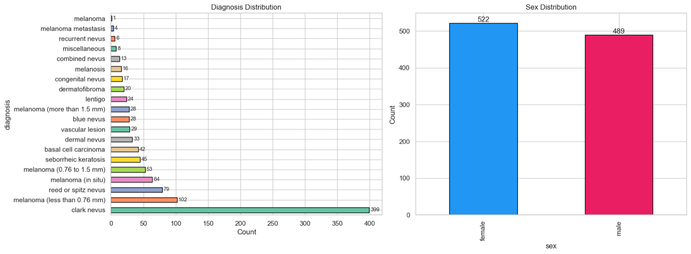
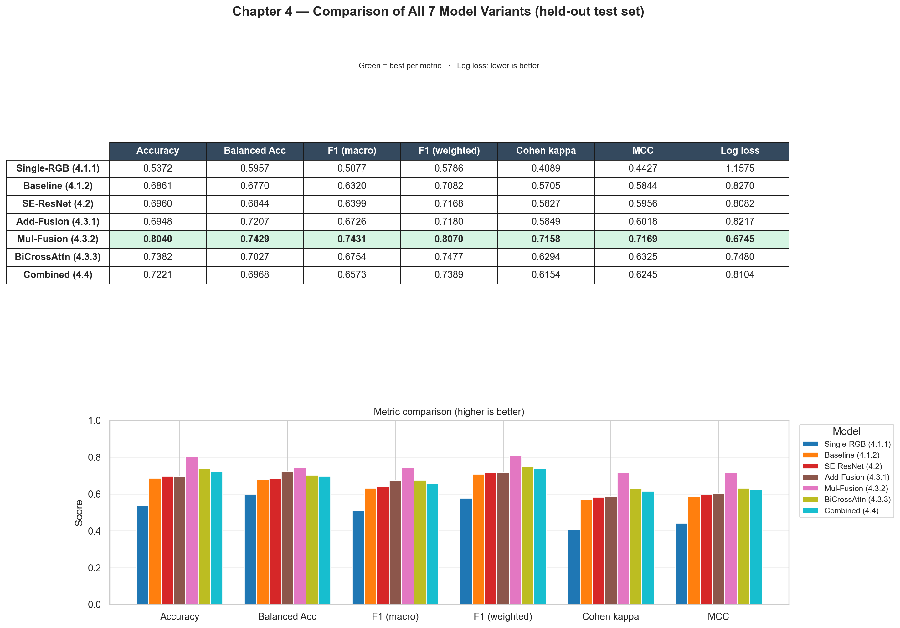
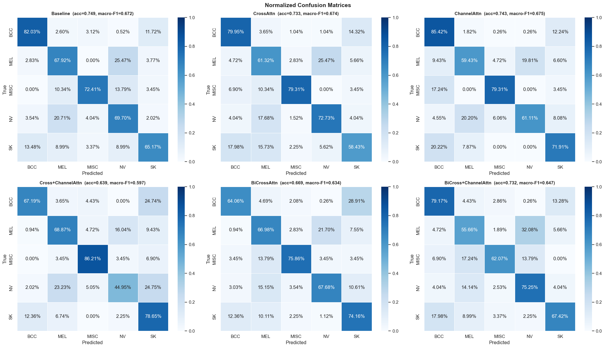
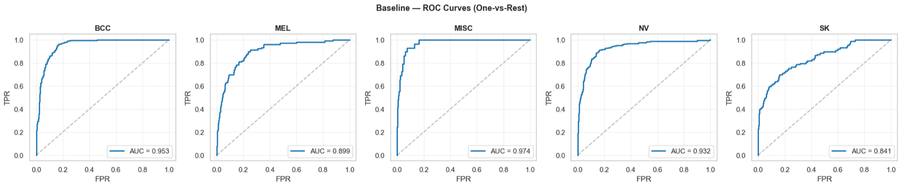

# Dual-Branch Skin Lesion Classification

*Teaching a network to read a lesion the way a dermatologist does — with two sets of eyes at once.*

When a dermatologist examines a suspicious mole, they rarely rely on a single view. They look at it with the naked eye, then again through a dermatoscope, a handheld lens that polarises light and magnifies the sub-surface structures invisible in an ordinary photograph. The two images tell different stories about the same lesion, and reading them together is part of the diagnostic craft. This project, developed as an undergraduate thesis, asks whether a convolutional network can learn that same habit: two ResNet50 backbones process the clinical and dermoscopic photographs in parallel, and their features are fused before a shared classifier assigns one of five diagnostic classes (MEL, NV, BCC, SK, MISC).



*Each column is one lesion seen twice — clinical photo on top, dermoscopic image below — followed by the two cross-attention maps the network learns. The clinical-to-dermoscopic and dermoscopic-to-clinical heatmaps show each branch steering the other's focus toward the lesion, which is the visual intuition the whole architecture is built around.*

## The problem

Two things make this task hard. The first is that the modalities are complementary rather than redundant: cues that are faint in a clinical photo can be obvious under dermoscopy, and vice versa, so a model that sees only one view leaves diagnostic information on the table. The second is class imbalance. Real dermatology archives are dominated by benign nevi, and the rarer, more dangerous categories sit in a long tail.



*The fine-grained diagnosis distribution in Derm7pt before the five-class remapping. The long tail — hundreds of clark nevi against a handful of the rarest melanomas — is exactly what the weighted sampling and weighted loss are designed to counteract.*

## The approach

- **Dual-branch fusion.** Two ImageNet-pretrained ResNet50 backbones each emit a 2048x7x7 feature map. The fusion head combines them (add / multiply / 1x1-conv concat), then applies BatchNorm, global average pooling, dropout, and two fully connected layers down to five logits.
- **Two paired datasets.** Derm7pt (1,011 cases) and MILK10k (4,361 usable cases after class mapping) are combined into 5,372 paired samples, both remapped onto a shared five-class schema.
- **Class-imbalance handling.** A WeightedRandomSampler plus inverse-frequency weighted cross-entropy counter the dominance of the nevus (NV) class.
- **Staged transfer learning.** Early epochs freeze the lower ResNet layers and train only `layer4` and the fusion head; later epochs unfreeze `layer3` at a halved learning rate.
- **Optuna hyperparameter search.** The final notebook treats every technique as an on/off toggle (fusion mode, loss type, label smoothing, MixUp, auxiliary head, SWA, cross-modal contrastive pretraining) and lets Optuna search per dataset, optimising validation macro-F1 with median pruning.
- **Multiple fusion experiments.** Additional notebooks benchmark add/multiply fusion, bidirectional cross-attention, and SE-ResNet variants against a baseline.

The fusion strategies are not created equal, and the thesis leans on ablation to say so rather than asserting it. Every variant is retrained and scored on the same held-out test set, then lined up side by side.



*All seven variants scored on the same test set across seven metrics. Multiplicative fusion (green row) wins on nearly every measure, which is the headline result of the fusion study.*

Aggregate scores hide where a model actually goes wrong, so each variant also gets a per-class breakdown. The confusion matrices make the failure modes legible — most notably the tendency to confuse melanoma with nevi, the very error that carries the highest clinical cost.



*Normalized confusion matrices for six attention and fusion variants. The diagonal shows per-class recall; the off-diagonal MEL/NV confusion is the pattern to watch in any skin-lesion classifier.*

Discrimination also holds up per class when measured with one-vs-rest ROC curves.



*Per-class one-vs-rest ROC curves for the baseline dual-branch model. BCC, MISC and NV separate cleanly; SK and MEL are the harder classes, consistent with the confusion matrices above.*

## Results

Ablation study on the held-out test set (n = 806), reported in `experimentation.md` and `ablation_results.csv`:

| Configuration | Accuracy | Balanced Acc. | F1 (macro) | Cohen's Kappa | MCC |
|---|---|---|---|---|---|
| A - Dual branch, Derm7pt only | 0.7303 | 0.6842 | 0.6408 | 0.5778 | 0.5861 |
| B - Dual branch, combined | 0.7605 | 0.7360 | 0.6955 | 0.6637 | 0.6701 |
| C - Single branch (dermoscopic), combined | 0.6501 | 0.6394 | 0.5650 | 0.5296 | 0.5434 |
| D - Single branch (clinical), combined | 0.4603 | 0.5715 | 0.4472 | 0.3375 | 0.3831 |

The full dual-branch model (B) reaches a macro AUC of 0.9403 on the test set. Two findings stand out: expanding the training corpus with MILK10k (A to B) raises macro-F1 by ~5.5 points, and using both modalities beats the best single-modality model (B vs C) by ~13 points macro-F1, confirming that the clinical and dermoscopic views carry complementary information.

## Tech stack

- Python, PyTorch, torchvision
- Optuna (hyperparameter search)
- scikit-learn (metrics), pandas, NumPy
- matplotlib, seaborn (visualisation)
- Runs on Apple Silicon (MPS), CUDA, or CPU (device auto-detected)

## Project structure

```
thesis_final.ipynb       Final model — per-dataset Optuna search, full retrain, evaluation
model.ipynb              Dual-branch ResNet50 + cross-attention + Optuna
thesis.ipynb             Baseline pipeline: EDA -> training -> evaluation
DualBranch.py            Reference dual-branch architecture (RGB + Hermite noise)
thesis.py                Standalone ResNet-18 baseline (Colab paths, reference only)
setup_datasets.py        Downloads Derm7pt + MILK10k from Kaggle into dataset/
experimentation.md       Thesis chapter: datasets, architecture, results, ablation
requirements.txt         Python dependencies
*.csv / *.png            Committed metrics tables and comparison figures
```

## Getting started

```bash
pip install -r requirements.txt
```

Requires Python 3.8+. Fetch the datasets (needs a Kaggle API token at `~/.kaggle/kaggle.json`):

```bash
python setup_datasets.py
```

Then open a notebook and run the cells sequentially:

```bash
jupyter notebook thesis_final.ipynb
```

In `thesis_final.ipynb`, set the `DATASET_DIR` switch to `Derm7pt` or `Milk10k` and run all cells; a `SMOKE_TEST` flag runs a fast 2-trial dry run to validate the pipeline before a full search.
